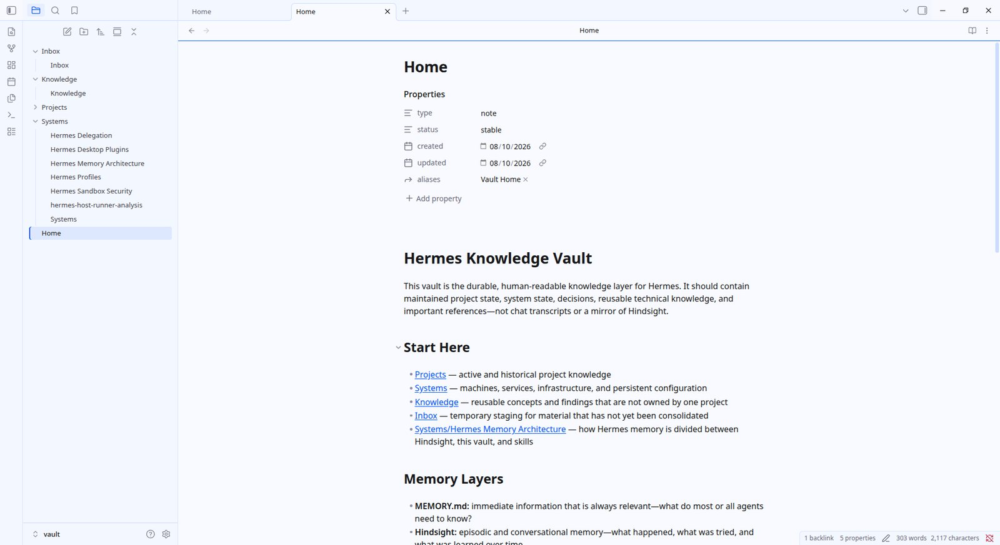
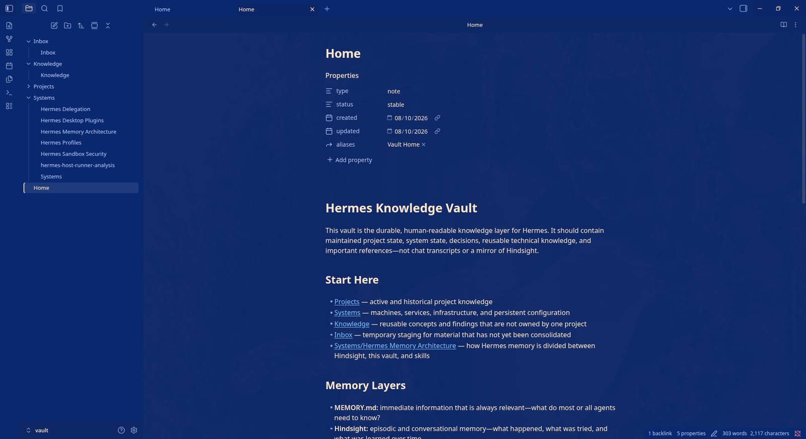

# Nous Research

An Obsidian theme that matches the **Hermes desktop app's Nous identity** —
glass neutrals with Nous blue accents in light mode, and the Psyche
cream-on-deep-blue dark mode, with the faint Hermes statue ghosted behind
your notes.

## Disclosure

This project was written with the use a Large Language Model agent. Most was
written by the agent itself; All of it has been reviewed by human eyes.

## Features

- **Light and dark modes** — light is glass-white (`#F8FAFF`) with Nous blue
  (`#0053FD`); dark is deep psyche blue (`#0E2766`) with warm cream text
  (`#FFE6CB`).
- **Faint statue backdrop** behind notes in dark mode — the same asset the
  Hermes desktop app renders. (`ds-assets/filler-bg0.jpg`)
- **Courier Prime** monospace, embedded as data URLs (no remote fonts).
- **WCAG AA** text contrast in both modes.
- Borderless dark chrome (glass look), amber selection, clearly underlined
  blue links, and framed callouts / code blocks / embeds / tables.
- All assets self-contained: `theme.css` + `manifest.json` only.

## Install

Obsidian → **Settings → Appearance → Themes → Manage → Browse** → search
"Nous Research".

## Files

- `theme.css` — the complete theme (self-contained)
- `manifest.json` — theme manifest
- `images/lightmode.jpg`, `images/darkmode.jpg` — screenshots

## License

Theme: [CC0 1.0](LICENSE) — public domain dedication. Embedded assets keep
their own licenses: **Courier Prime** (SIL Open Font License 1.1,
© 2015 The Courier Prime Project Authors) and the **background image**
(MIT, © 2025 Nous Research / Hermes Agent) — see
[LICENSE-THIRD-PARTY.md](LICENSE-THIRD-PARTY.md).
